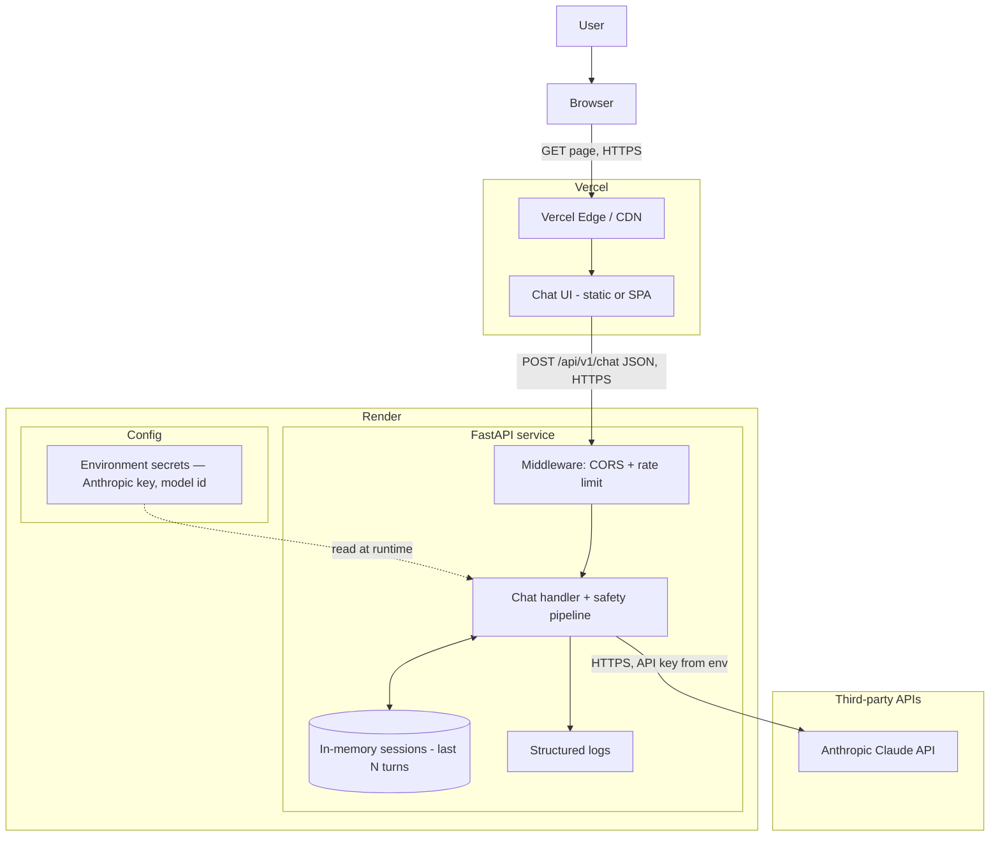
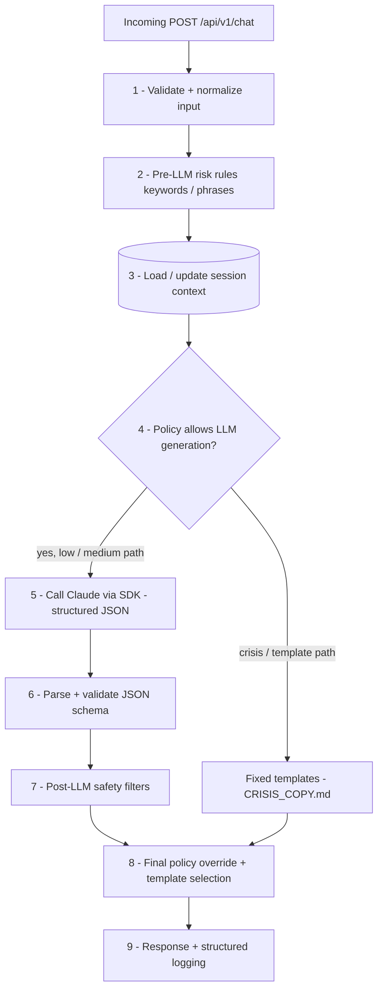

# MindCare Design Document (v0.1)

## 1\. Purpose and goals

**Problem:** Many people need low‑barrier, stigma‑free emotional support, but access to human support is limited by cost, availability, and timing (especially nights and weekends).

**MindCare’s Role:**

* Provide a 24/7, conversational, AI‑driven companion that helps users reflect on their feelings and learn basic coping strategies.  
* Encourage connection to real people and professional help when needed, not replace them.

**Primary goals (MVP):**

* Offer warm, validating, human‑like conversations around day‑to‑day emotional struggles.  
* Gently suggest evidence‑informed self‑help strategies (grounding, journaling prompts, behavioral activation) without acting as a therapist.  
* Detect signs of self‑harm/suicidal ideation and respond with safe, pre‑approved crisis guidance and resources.  
  * Risk detection will use a layered approach: keyword/phrase rules as a fast pre-filter, then LLM-evaluated risk level in the structured JSON response.

**Non‑goals (what MindCare will NOT do):**

* Diagnose any mental health condition.  
* Give medication or treatment instructions.  
* Provide emergency intervention or guarantee contact with a human professional.

## 2\. Target users and usage scenarios

**Target users:**

* Global users (all ages) who want anonymous emotional support and psychoeducation.
* People who are hesitant to see a therapist or are on waitlists and want “someone to talk to” right now.

**Example use cases:**

* “I’m really anxious about school and can’t sleep.”  
* “I feel lonely and like no one understands me.”  
* “I’m happy something good happened and I want to share it.”  
* “I’m having thoughts about hurting myself.”

## 3\. High‑level system overview

**Architecture (MVP):**

* Frontend:  
  * Simple web chat UI hosted separately (static host or SPA): e.g. GitHub Pages, Netlify, Vercel, Cloudflare Pages—or embedded in any page (including Google Sites via iframe) if you want a free wrapper.  
  * Can later be replaced with a dedicated web app; the API contract stays the same.  
* Backend (core):  
  * Python/FastAPI REST API with main endpoint /api/v1/chat.  
  * Integrates with an LLM provider to generate responses.  
  * Implements safety checks and logging around each interaction.  
* Data storage:  
  * Out of MVP scope; start with ephemeral session memory only.  
* External services:  
  * LLM API (Claude for MVP).
  * Optional monitoring/logging service later.

### Architecture diagram (MVP)

The diagrams below use **Vercel** for the frontend and **Render** for the API. **Netlify, GitHub Pages, Cloudflare Pages**, or another static/SPA host are equivalent to Vercel for the UI.

**MVP scope called out in the diagrams:** **No user authentication** (anonymous `session_id` only), **no persistent database** (in-process memory only), **no separate Redis** unless you add it later. **Secrets** live in Render (and optional non-secret env on Vercel for public config like API base URL). **DNS and TLS** are provided by Vercel and Render; **CDN/edge** is implicit on Vercel for static assets.

#### Figure 1 — Deployment and major components

Shows *where* things run and *what* talks to what. Only the **LLM client** inside your service calls Anthropic; session data is not a separate “connector” to Claude.

**Post-MVP (dashed idea, not required now):** external **metrics/APM** (e.g. hosted logging), **managed DB** for sessions or audit logs, **Redis** for shared session if you scale beyond one instance.

#### Figure 2 — Logical request path inside the API

Matches the deterministic pipeline in `docs/SAFETY_POLICY.md` §4. Not every step calls the LLM (e.g. high-risk may use fixed templates from `docs/CRISIS_COPY.md` without a normal completion).

**Why omit auth, DB, and Redis from the boxes?** For MVP they are intentionally absent: sessions are **ephemeral** and **per server process** (`docs/DECISIONS_LOG.md`). Adding **Clerk/Auth0** or **Postgres** would be new components and belong in a post-MVP diagram.

**Request path (reference):** full policy detail is in `docs/SAFETY_POLICY.md`; API fields are in `docs/API_CONTRACT.md`.

## 4\. Functional requirements (MVP)

**FR‑1: Chatting**

* User can send a free‑text message and receive a response within N seconds (target: ≤ 8 s).  
* System preserves the last N turns of conversation context per session (e.g., last 8–10 messages).

**FR‑2: Session handling**

* System assigns a session\_id for each new visitor.  
* System keeps short in-memory chat context for response quality during the active session.

**FR‑3: Emotional support behavior**

* Each non‑crisis reply should:  
  * Acknowledge and validate the user’s feelings.  
  * Briefly reflect what the user said (paraphrase).  
  * Offer either a gentle question or a concrete coping suggestion (e.g., grounding exercise, small action).

**FR‑4: Crisis detection and response**

* System identifies messages suggesting self‑harm/suicide or harm to others using a classifier/keyword rules.  
* On high risk:  
  * Returns a fixed, pre‑approved crisis message with hotline/emergency guidance.  
  * Does NOT engage in speculative discussion (e.g., “Is life worth living?” replies must be very carefully constrained).  
* On medium risk:  
  * Encourages the user to reach out to trusted people and professional help, possibly with tailored resources.

**FR‑5: Content limitations**

* System must refuse to:  
  * Give diagnostic labels (e.g., “You have depression”).  
  * Provide medication dosages or changes.  
  * Provide instructions for self‑harm or harming others.

**FR-6: Rate limiting and abuse prevention**

* Add a basic rate-limit requirement (e.g., max N messages per session per minute)

**FR-7: Disclaimers and onboarding**

* Show a disclaimer to the user.

## 5\. Non‑functional requirements

**NFR‑1: Safety and ethics**

* Align with mental‑health chatbot safety guidelines (APA and recent research): clear disclaimers, no impersonation of human clinicians, and consistent crisis procedures.

**NFR‑2: Privacy**

* No collection of real names, email, phone, or exact location in the MVP.  
* IP addresses only stored if absolutely needed for security/abuse prevention and not linked to content where possible.  
* Since conversation storage is out of MVP scope, data handling remains ephemeral for initial release.

**NFR‑3: Performance**

* 95th percentile response latency under 8 seconds at MVP load.  
* Degradation strategy if LLM is slow/unavailable (e.g., “I’m having trouble responding right now, please try again soon.”).

**NFR‑4: Reliability**

* /health endpoint indicates backend and LLM connectivity.  
* Logs allow tracing each request/response pair with session and risk level.

## 6\. Safety model and policies

**Risk levels:**

* Low: Everyday stress, mild sadness/anxiety, neutral or positive content.  
* Medium: Expressions of hopelessness or distress without explicit self‑harm intent. (“I don’t see the point of anything.”)  
* High: Explicit self‑harm/suicide ideation or plan, or threats to others.

**Policy rules (simplified):**

* For low risk messages: use standard supportive prompt, free‑flow conversation allowed within constraints.  
* For medium risk:  
  * Increase empathy and validation.  
  * Always recommend talking to a trusted person and/or professional.  
  * Provide relevant resources (e.g., NAMI, 988 in the U.S., Crisis Text Line).  
* For high risk:  
  * Return a fixed crisis template (no improvisation from LLM).  
  * Emphasize contacting emergency services or crisis hotlines; clarify MindCare cannot provide emergency help.

**LLM usage policy:**

* All LLM calls use a strict system prompt with:  
  * Role and limitations.  
  * Safety instructions.  
  * Required JSON output schema (e.g., reply\_text, risk\_level\_suggested, style\_flags).  
* Post‑processing filters check for banned content and can override the response.

## 7\. Technology choices

**Backend:**

* Python 3.x, FastAPI, Uvicorn.  
* Async HTTP client (httpx) for LLM calls.  
* SQLAlchemy or another ORM for DB access (post-MVP when persistence is introduced).

**Database:**

* Post-MVP: managed Postgres (Supabase/Neon/etc.) for structured logs and sessions.

**Frontend (initial):**

* Simple React or vanilla JS chat widget hosted on Netlify/Vercel/GitHub Pages/Cloudflare Pages (or another static host).

**LLM provider:**

* Claude (Anthropic), provided use remains aligned with provider policy for mental-health-adjacent support. Must support:  
  * System prompts,  
  * JSON‑formatted output,  
  * Policy for mental‑health–adjacent use.

## 8\. Data model (conceptual, post-MVP)

**Session:**

* id (UUID)  
* created\_at, last\_active\_at  
* client\_metadata (user agent, locale, approximate region)

**Message:**

* id (UUID)  
* session\_id  
* role (user/assistant)  
* text  
* risk\_level (low/medium/high)  
* created\_at

Note: Session/message tables are conceptual and can be introduced post-MVP when persistence is implemented.

**Event (optional, later):**

* id, session\_id, type (e.g., feedback\_helpful, feedback\_unhelpful, high\_risk\_triggered)  
* metadata JSON

## 9\. Open questions and risks

* **Jurisdiction and compliance:** If usage grows beyond friends/testing, do we need HIPAA‑level controls or other regulatory review?  
* **Age strategy:** MVP uses a single safety policy for all users. Revisit youth-specific guidance/resources in later phases.
* **Abuse and misuse:** How do we handle users who try to game the system, prompt‑inject the LLM, or seek harmful content?  
* **Scaling:** At what point do we need more robust monitoring, rate‑limiting, and cost controls for LLM usage?  
* **LLM:** Claude selected for MVP; continue periodic checks against provider terms for mental-health-adjacent use.
* **Language translation:** How do we handle multilingual users?